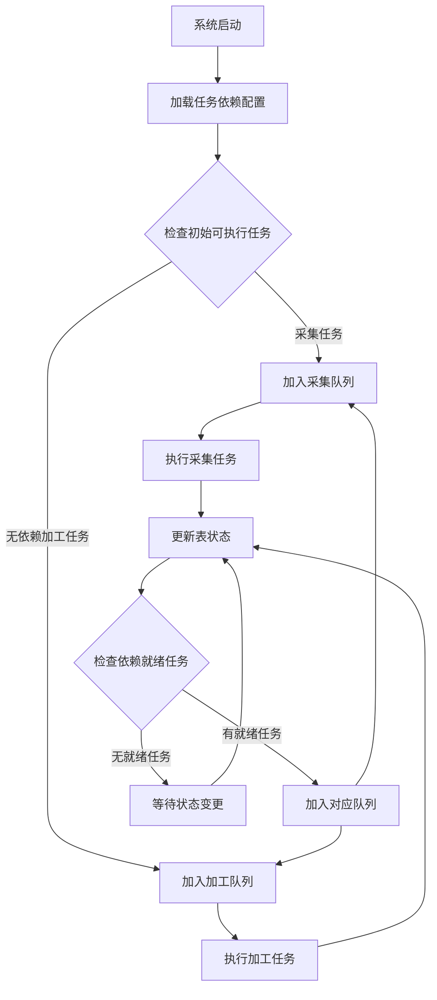

# 大数据任务依赖调度系统技术方案设计

## 1. 总体架构设计

### 1.1 系统架构图
```
┌─────────────────────────────────────────────────────┐
│                 任务调度控制层                        │
├─────────────────────────────────────────────────────┤
│            依赖解析器 │ 状态管理器 │ 调度器            │
└─────────────────────────────────────────────────────┘
                            │
┌─────────────────────────────────────────────────────┐
│                 任务执行层                           │
├─────────────┬─────────────┬─────────────┬─────────┤
│ 采集任务队列 │ 加工任务队列 │ 实时监控    │ 日志管理 │
└─────────────┴─────────────┴─────────────┴─────────┘
                            │
┌─────────────────────────────────────────────────────┐
│                 存储层                               │
├─────────────┬─────────────┬─────────────┬─────────┤
│ 元数据存储  │ 状态存储    │ 任务配置    │ 历史记录 │
└─────────────┴─────────────┴─────────────┴─────────┘
```

## 2. 核心组件设计

### 2.1 依赖关系管理器
```python
class DependencyManager:
    def __init__(self):
        self.graph = nx.DiGraph()  # 使用有向无环图
        self.table_status = {}      # 表状态存储
        self.dep_mapping = {}       # 依赖关系映射
    
    def add_dependency(self, table, dependencies):
        """添加表依赖关系"""
        self.graph.add_node(table)
        for dep in dependencies:
            self.graph.add_edge(dep, table)
            self.dep_mapping.setdefault(table, []).append(dep)
    
    def check_dependencies_ready(self, table):
        """检查表的所有依赖是否完成"""
        deps = self.dep_mapping.get(table, [])
        return all(self.table_status.get(dep) == "SUCCESS" for dep in deps)
    
    def get_ready_tables(self):
        """获取所有依赖就绪的表"""
        ready_tables = []
        for table in self.graph.nodes():
            if self.table_status.get(table) is None:  # 未开始执行
                if self.check_dependencies_ready(table):
                    ready_tables.append(table)
        return ready_tables
```

### 2.2 状态管理器
```python
class StatusManager:
    def __init__(self, redis_client):
        self.redis = redis_client
        self.STATUS_KEY = "table:status:{table}"
        self.DEPENDENCY_KEY = "table:deps:{table}"
    
    def update_status(self, table, status, metadata=None):
        """更新表状态"""
        status_data = {
            "status": status,
            "update_time": datetime.now().isoformat(),
            "metadata": metadata or {}
        }
        # 存储到Redis
        self.redis.hset("table_status", table, json.dumps(status_data))
        
        # 发布状态变更事件
        self.redis.publish("table_status_changed", 
                          json.dumps({"table": table, "status": status}))
    
    def get_status(self, table):
        """获取表状态"""
        data = self.redis.hget("table_status", table)
        return json.loads(data) if data else None
```

### 2.3 任务调度器
```java
public class TaskScheduler {
    // 线程池配置
    private ThreadPoolExecutor executor = new ThreadPoolExecutor(
        10, 50, 60L, TimeUnit.SECONDS,
        new LinkedBlockingQueue<>(1000)
    );
    
    // 任务队列
    private PriorityBlockingQueue<Task> taskQueue = 
        new PriorityBlockingQueue<>(1000, new TaskPriorityComparator());
    
    public void scheduleTask(Task task) {
        if (checkDependencies(task)) {
            taskQueue.offer(task);
            executor.submit(() -> executeTask(task));
        } else {
            // 放入等待队列
            waitingTasks.put(task.getId(), task);
        }
    }
    
    private boolean checkDependencies(Task task) {
        for (String depTable : task.getDependencies()) {
            TableStatus status = statusManager.getStatus(depTable);
            if (status != TableStatus.SUCCESS) {
                return false;
            }
        }
        return true;
    }
}
```

## 3. 存储设计

### 3.1 元数据表设计
```sql
-- 任务依赖关系表
CREATE TABLE task_dependencies (
    task_id VARCHAR(100) PRIMARY KEY,
    table_name VARCHAR(200) NOT NULL,
    task_type ENUM('COLLECT', 'PROCESS') NOT NULL,
    dependencies JSON,  -- 依赖表列表
    priority INT DEFAULT 5,
    config JSON,  -- 任务配置
    created_time TIMESTAMP DEFAULT CURRENT_TIMESTAMP
);

-- 任务执行状态表
CREATE TABLE task_execution (
    execution_id BIGINT AUTO_INCREMENT PRIMARY KEY,
    task_id VARCHAR(100),
    status ENUM('PENDING', 'RUNNING', 'SUCCESS', 'FAILED', 'RETRY') NOT NULL,
    start_time TIMESTAMP,
    end_time TIMESTAMP,
    error_message TEXT,
    retry_count INT DEFAULT 0,
    INDEX idx_task_status (task_id, status)
);

-- 表状态快照
CREATE TABLE table_status_snapshot (
    table_name VARCHAR(200) PRIMARY KEY,
    last_success_time TIMESTAMP,
    data_size BIGINT,
    row_count BIGINT,
    quality_score DECIMAL(5,2),
    update_time TIMESTAMP DEFAULT CURRENT_TIMESTAMP ON UPDATE CURRENT_TIMESTAMP
);
```

### 3.2 Redis数据结构设计
```yaml
# Key设计：
table:status:{table_name} -> Hash
  - status: "SUCCESS"/"FAILED"/"RUNNING"
  - update_time: timestamp
  - data_size: 123456
  - checksum: xxx

table:deps:{table_name} -> Set
  - 存储所有依赖此表的任务ID
  
task:queue:pending -> SortedSet
  - member: task_id
  - score: priority + timestamp

task:running:{worker_id} -> Hash
  - 记录worker正在执行的任务
```

## 4. 工作流程设计

### 4.1 整体流程


### 4.2 状态机设计
```
任务状态流转：
PENDING → RUNNING → SUCCESS/FAILED
FAILED → RETRY (最多3次) → PENDING/FAILED

表状态流转：
INIT → COLLECTING → COLLECTED/FAILED
COLLECTED → PROCESSING → PROCESSED/FAILED
```

## 5. 监控与告警

### 5.1 监控指标
```python
# Prometheus监控指标
COLLECTOR_METRICS = [
    "table_collect_duration_seconds",
    "table_collect_success_total",
    "table_collect_failed_total",
    "dependency_wait_time_seconds",
    "queue_size_current",
    "task_execution_duration_seconds"
]

# 关键告警规则
ALERT_RULES = {
    "task_failed": "rate(task_failed_total[5m]) > 0.1",
    "dependency_deadlock": "dependency_wait_time_seconds > 3600",
    "queue_overflow": "queue_size_current > 1000"
}
```

### 5.2 健康检查
```yaml
health_check_endpoints:
  - /health/readiness: 检查数据库连接
  - /health/liveness: 检查服务状态
  - /metrics: Prometheus指标
  - /status/dependencies: 依赖图状态
```

## 6. 容错与高可用

### 6.1 故障恢复策略
```python
class FaultToleranceManager:
    def __init__(self):
        self.max_retries = 3
        self.retry_delays = [10, 30, 60]  # 重试延迟
    
    def handle_task_failure(self, task_id, error):
        """处理任务失败"""
        retry_count = self.get_retry_count(task_id)
        
        if retry_count < self.max_retries:
            # 延迟重试
            delay = self.retry_delays[retry_count]
            self.schedule_retry(task_id, delay)
        else:
            # 标记为失败，触发告警
            self.mark_as_failed(task_id)
            self.alert_ops(task_id, error)
            
            # 检查是否有后续依赖任务
            self.check_downstream_tasks(task_id)
    
    def check_downstream_tasks(self, failed_table):
        """检查依赖此表的后续任务"""
        downstream_tasks = dependency_manager.get_dependent_tasks(failed_table)
        for task in downstream_tasks:
            if task.is_optional:
                # 可选依赖，标记为跳过
                self.mark_task_skipped(task.id)
            else:
                # 必需依赖，标记为失败
                self.mark_task_failed(task.id, f"依赖表{failed_table}失败")
```

## 7. 扩展性设计

### 7.1 插件化架构
```java
// 任务执行器接口
public interface TaskExecutor {
    String getType();
    TaskResult execute(TaskConfig config);
    boolean validate(TaskConfig config);
}

// 插件管理器
public class PluginManager {
    private Map<String, TaskExecutor> executors = new ConcurrentHashMap<>();
    
    public void registerExecutor(String type, TaskExecutor executor) {
        executors.put(type, executor);
    }
    
    public TaskResult executeTask(Task task) {
        TaskExecutor executor = executors.get(task.getType());
        if (executor != null) {
            return executor.execute(task.getConfig());
        }
        throw new UnsupportedOperationException("Unsupported task type: " + task.getType());
    }
}
```

## 8. 部署方案

### 8.1 容器化部署
```dockerfile
# Dockerfile
FROM openjdk:11-jre-slim
WORKDIR /app
COPY target/scheduler.jar /app/
COPY config/application.yml /app/config/

# 健康检查
HEALTHCHECK --interval=30s --timeout=3s \
  CMD curl -f http://localhost:8080/health || exit 1

# 启动命令
CMD ["java", "-jar", "scheduler.jar"]
```

### 8.2 Kubernetes配置
```yaml
# deployment.yaml
apiVersion: apps/v1
kind: Deployment
metadata:
  name: task-scheduler
spec:
  replicas: 3
  strategy:
    type: RollingUpdate
  template:
    spec:
      containers:
      - name: scheduler
        image: scheduler:latest
        env:
        - name: REDIS_HOST
          value: "redis-cluster"
        - name: DB_HOST
          value: "mysql-cluster"
        resources:
          requests:
            memory: "512Mi"
            cpu: "250m"
          limits:
            memory: "2Gi"
            cpu: "1000m"
        livenessProbe:
          httpGet:
            path: /health/liveness
            port: 8080
```

## 9. 测试策略

### 9.1 测试用例设计
```python
class TestDependencyScheduler:
    def test_linear_dependency(self):
        """测试线性依赖 A -> B -> C"""
        scheduler = TaskScheduler()
        scheduler.add_task("A", [])
        scheduler.add_task("B", ["A"])
        scheduler.add_task("C", ["B"])
        
        result = scheduler.execute()
        assert result.execution_order == ["A", "B", "C"]
    
    def test_parallel_dependency(self):
        """测试并行依赖 A -> C, B -> C"""
        scheduler = TaskScheduler()
        scheduler.add_task("A", [])
        scheduler.add_task("B", [])
        scheduler.add_task("C", ["A", "B"])
        
        result = scheduler.execute()
        # A和B应该并行执行
        assert set(result.first_two) == {"A", "B"}
        assert result.last == "C"
    
    def test_circular_dependency(self):
        """测试循环依赖检测"""
        scheduler = TaskScheduler()
        with pytest.raises(CircularDependencyError):
            scheduler.add_task("A", ["C"])
            scheduler.add_task("B", ["A"])
            scheduler.add_task("C", ["B"])
```

## 10. 性能优化建议

1. **批量状态更新**：合并小状态更新，减少Redis操作
2. **依赖缓存**：缓存依赖关系图，避免重复计算
3. **异步处理**：非关键路径异步化
4. **分片调度**：按业务域分片，减少锁竞争
5. **增量检查**：只检查状态变更相关的依赖

## 总结

本方案提供了完整的任务依赖调度系统设计，具有以下特点：

1. **灵活依赖管理**：支持复杂依赖关系，自动检测循环依赖
2. **高可用性**：多副本部署，故障自动恢复
3. **可扩展性**：插件化架构，易于扩展新任务类型
4. **实时监控**：完整的监控告警体系
5. **容错性强**：完善的失败重试和降级机制

系统可根据实际业务需求进行裁剪，建议从核心的依赖管理和状态跟踪开始，逐步完善监控和调度功能。